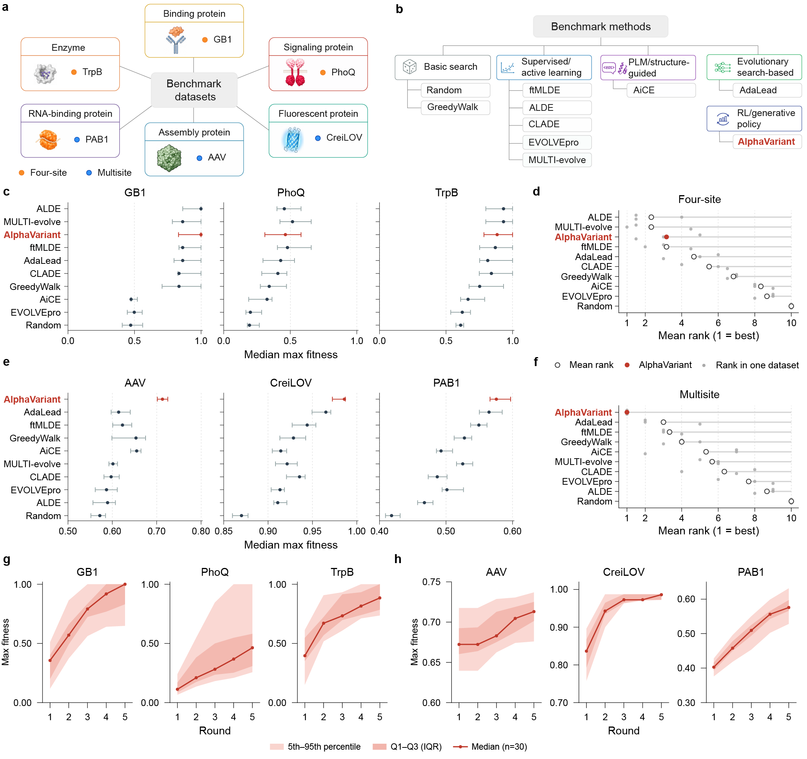

# Protein Optimization Benchmark Suite

Head-to-head evaluation of 10 protein-optimization / directed-evolution methods
under a fixed query budget, on two complementary benchmark panels: **four-site
combinatorially-complete landscapes** (true-fitness pool selection) and
**multi-site learned-oracle landscapes** (generative proposal against a trained
CNN oracle).

Every (method, dataset) cell is run for the **same 30 seeds**, so all
comparisons are paired.

## Overview


## 1. Benchmark panels

### Panel A — Four-site, true landscape (pool selection)

The 20⁴ ≈ 160k variant libraries are (near-)completely measured, so no learned
oracle is needed: methods select 96 sequences/round × 5 rounds from the real
library and are scored against the measured fitness.

| Dataset | n | Seq len | Sites | Fitness range | Global max |
|---|---:|---:|---|---|---:|
| `4site_GB1` | 149,361 | 56 | V39, D40, G41, V54 | 0 – 8.762 | 8.761966 |
| `4site_PhoQ` | 140,517 | 486 | A284, V285, S288, T289 | 0 – 133.6 | 133.5943 |
| `4site_TRPB` | 159,129 | 397 | V183, F184, S227, S228 | 0 – 1 (pre-normalized) | 1.0 |

### Panel B — Multi-site, learned oracle (generative proposal)

Sparse/variable landscapes where exhaustive lookup is impossible. A `BaseCNN`
oracle is trained on the full dataset and then used as the fitness function;
methods propose sequences rather than pick table rows.

| Dataset | n | Seq len | Varying positions | Fitness range | Oracle test ρ |
|---|---:|---:|---:|---|---:|
| `ms_AAV` | 44,128 | 28 | 28 | 0 – 1 | 0.892 |
| `ms_CreiLOV` | 165,428 | 119 | 15 | 620 – 15,690 | 0.978 |
| `ms_PAB1` | 36,522 | 75 | 75 | 0.0024 – 2.628 | 0.904 |

Oracle checkpoints live in `oracles/<dataset>/oracle.pt` (+ `oracle_meta.json`
carrying `fit_min` / `fit_max` for de-normalization). Held-out test metrics:
`figures/ms_oracles/oracle_test_metrics.csv`.

### Dataset directory contents

Every `data/<dataset>/` holds `data.csv` (columns `seq`, `fitness`, plus
`AACombo` / `n_muts`), `wt.fasta`, a structure `*.pdb` and `mutcompute.csv`.
The remaining artifacts are panel-specific:

| Artifact | Panel A | Panel B | Consumer |
|---|:-:|:-:|---|
| `embeddings_evolvepro.pt` + `labels_evolvepro.csv` | ✓ | — | EVOLVEpro (frozen ESM-2 embeddings) |
| `varying_positions.txt` + `target_seqs.fasta` | — | ✓ | design space for the oracle panel |
| `plmc/` | — | ✓ | EVmutation couplings (AlphaVariant `ev_onehot`) |
| `prior_aligned.csv` | — | ✓ | homolog alignment for the AlphaVariant prior |
| `aice_mpnn_freq.npz` | — | ✓ | AiCE ProteinMPNN residue frequencies |

`data/` is git-ignored (182 MB of CSVs); regenerate it with
`scripts/prepare_combingym.py` / `scripts/prepare_proteingym.py` and verify with
`sha256sum -c data/CHECKSUMS.txt` from the benchmark root. Full per-file
documentation: `data/README.md`.

### Shared protocol

- **Batch size** 96, **rounds** 5 (1 random init + 4 model-guided) → **480 queries**
- **Seeds** the first 30 entries of `rand_seeds.txt` (621, 100, 383, … 511)
- Initial round is uniform-random — no fitness leak into initialization

---

## 2. Methods

Ten methods in the headline comparison. Each bullet gives what the method
does and the conda env it runs under. `FLEXS` (Panel A) and `AdaLead` (Panel B)
are the same AdaLead algorithm and are unified under **AdaLead** in the figures.

- **Random** — uniform sampling from the design space, no model. The floor every
  other method has to beat. *Env:* reuses `ALDE/env`.
- **GreedyWalk** — hill climbing: each round takes single-mutant neighbours of
  the best sequence found so far. *Env:* reuses `ALDE/env`.
- **ALDE** — Bayesian active learning. Fits an ensemble surrogate on everything
  measured so far and picks the next batch by Thompson sampling. *Env:* `ALDE/env`.
- **AdaLead** (FLEXS) — adaptive greedy model-guided search: mutate-and-screen
  around the current top hits, with the surrogate acting as a cheap filter.
  *Env:* `FLEXS/env` (Panel A); the Panel B driver runs it under `ALDE/env`.
- **ftMLDE** — focused-training MLDE. Trains a zoo of regressors on the measured
  variants, cross-validates to pick the best one, then screens the pool with it.
  *Env:* `ftMLDE/env`.
- **CLADE 2.0** — cluster-based MLDE. k-means the sequence space and spend the
  batch across clusters, so the surrogate is trained on a spread of the
  landscape rather than one basin. *Env:* `CLADE/env` (symlink to `ALDE/env`).
- **MULTIevolve** — supervised batch design that explicitly models epistasis
  between candidate mutations when assembling multi-mutant batches.
  *Env:* `MULTIevolve/env`.
- **EVOLVEpro** — few-shot active learning on frozen ESM-2 embeddings: a light
  top-N regressor over PLM features, no fine-tuning. *Env:* `EVOLVEpro/env`
  (the Panel B driver needs the transformers/ESM stack from `alphavariant-env`).
- **AiCE** — structure-aware and largely zero-shot: ProteinMPNN inverse-folding
  residue probabilities, filtered by evolutionary frequency. *Env:* `AiCE/env`.
- **AlphaVariant** — VariantGPT generates candidates and is trained with
  REINFORCE against a surrogate ensemble, with MutCompute reward shaping and
  SHAP alphabet pruning (§3). *Env:* `/home/xux/miniforge3/envs/alphavariant-env`.

**Current results** (mean rank across each panel's 3 datasets, max fitness —
`figures/ranking_panel_*_max_fitness_values.csv`):

| | Panel A (four-site) | Panel B (multi-site oracle) |
|---|---|---|
| 1 | ALDE / MULTIevolve (2.33) | **AlphaVariant (1.00)** |
| 2 | AlphaVariant / ftMLDE (3.17) | AdaLead (3.00) |
| 3 | AdaLead (4.67) | ftMLDE (3.33) |
| … | CLADE, GreedyWalk, AiCE, EVOLVEpro, Random | GreedyWalk, AiCE, MULTIevolve, CLADE, EVOLVEpro, ALDE, Random |

Paired Wilcoxon tests (Bonferroni-corrected, n=30):
`figures/wilcoxon_summary.md` (Panel A) and
`figures/ms_oracles/wilcoxon_summary.md` (Panel B).

---

## 3. Running the benchmark

### Per-method run scripts (the canonical path)

Scripts live in `scripts/<method>/` — the only place they live. Each method
exposes a single `run_generic.py`, selected by `--dataset`, and writes a full
15-field `metrics_seed<S>.json` per seed.

```bash
# Run from the benchmark root with that method's env python
ALDE/env/bin/python   scripts/ALDE/run_generic.py   --dataset 4site_GB1  --seed 621
ftMLDE/env/bin/python scripts/ftMLDE/run_generic.py --dataset 4site_PhoQ --seed 621
AiCE/env/bin/python   scripts/AiCE/run_generic.py   --dataset 4site_TRPB --seed 621

# 30 seeds from the shared seed file
ALDE/env/bin/python scripts/ALDE/run_generic.py --dataset 4site_GB1 \
    --seed_file rand_seeds.txt --num_seeds 30

# Faster iteration: skip the metric suite
ALDE/env/bin/python scripts/ALDE/run_generic.py --dataset 4site_GB1 --seed 621 --skip_metrics
```

Each script finds the benchmark root by walking up from its own location and
anchors `--output_path` under `<Method>/results/`, so **the working directory does
not matter** — results land in the same place either way.

Shared `run_generic.py` flags: `--dataset`, `--seed` / `--seeds` / `--seed_file`
+ `--num_seeds`, `--device`, `--output_path` (default
`<Method>/results/<dataset>_<method>/`, resolved absolutely), `--data_dir`,
`--skip_metrics`.

Results land at `<method>/results/<dataset>_<method>/<dataset>/<variant>/metrics_seed<S>.json`
(e.g. `ALDE/results/4site_GB1_ALDE/4site_GB1/onehot/`, `AiCE/.../aice/`,
`ftMLDE/.../ftmlde/`, `CLADE/.../clade/`, `EVOLVEpro/.../topn/`).

### Unified panel drivers

Two drivers implement all baselines in one process with **identical selection
rules across both panels**, so `ALDE`/`CLADE`/`ftMLDE` mean the same thing in
Panel A and Panel B. They emit the compact headline schema
(`max_fitness_norm`, `top128_mean_norm`, `diversity_top128`,
`novelty_top128_vs_wt`, `fitness_trajectory`, …).

```bash
# Panel B — learned oracle (Random, GreedyWalk, ftMLDE, CLADE, ALDE,
#           AdaLead, MULTIevolve, EVOLVEpro, AiCE)
ALDE/env/bin/python scripts/run_oracle_benchmark.py \
    --method ALDE --dataset ms_CreiLOV --seeds 621 100 383 --device cuda:0

# Panel A — true landscape, CPU-only (Random, GreedyWalk, ftMLDE, CLADE, ALDE)
python scripts/run_4site_benchmark.py --method ftMLDE --dataset 4site_GB1 --seeds 621 100
```

Panel B output: `results_oracle/<dataset>/<method>/seed<S>.json`.

### AlphaVariant

One configuration is used throughout — it is the default, and it is what every
AlphaVariant curve and point in the benchmark figures comes from: GPT-REINFORCE
generation + surrogate ensemble, with **MutCompute** (structure-based zero-shot)
reward shaping and **SHAP** per-position alphabet pruning. The two command
lines below are the exact ones behind those results; the flag table says which
flags apply to which panel.

Paths passed on the command line (`--prior_model_path`, `--data_dir`) are
relative to the working directory, so the examples below `cd alphavariant`
first; the script itself works from anywhere.

> **Environment**: put the env's `libstdc++` on the path or matplotlib/torch
> fail with a `CXXABI` error:
> ```bash
> export LD_LIBRARY_PATH=/home/xux/miniforge3/envs/alphavariant-env/lib:$LD_LIBRARY_PATH
> ```

**Panel A** (`4site_GB1`, `4site_PhoQ`, `4site_TRPB`) — lookup-table landscape:

```bash
cd alphavariant
/home/xux/miniforge3/envs/alphavariant-env/bin/python ../scripts/alphavariant/run_generic.py --dataset 4site_PhoQ --seed 621 \
    --use_mutcompute --plm_reward_lambda 0.5 --shap_prune_alphabet
```

**Panel B** (`ms_AAV`, `ms_CreiLOV`, `ms_PAB1`) — CNN oracle landscape,
generative proposal over the varying positions:

```bash
cd alphavariant
/home/xux/miniforge3/envs/alphavariant-env/bin/python ../scripts/alphavariant/run_generic.py --dataset ms_CreiLOV --seed 621 \
    --oracle --level uniform \
    --prior_model_path priors/ms_CreiLOV/prior_model.pt \
    --features ev_onehot --use_mutcompute --shap_prune_alphabet \
    --max_n_mut 2 \
    --n_rounds 5 --n_steps_per_round 500 --device cuda:0 \
    --data_dir ../data
```

| Flag | Panel A | Panel B | Role |
|---|:-:|:-:|---|
| `--features ev_onehot` | — | ✓ | Add the EVmutation/plmc statistical-energy column to the aa+one-hot surrogate features (Panel A uses aa+one-hot only) |
| `--use_mutcompute` | ✓ | ✓* | MutCompute zero-shot scorer; *consumed only on Panel A (reward shaping). Inert on Panel B (no consumer enabled) |
| `--plm_reward_lambda 0.5` | ✓ | — | Blend the MutCompute z-score into the REINFORCE reward (λ decays over rounds) |
| `--shap_prune_alphabet` | ✓ | ✓ | SHAP per-position alphabet pruning; the pruned alphabet is propagated into the GPT hotspot config so later rounds sample the pruned subspace |
| `--max_n_mut 2` | — | ✓ | Cap generated variants at ≤ 2 mutations from the reference |
| `--oracle --prior_model_path …` | — | ✓ | Score via the trained CNN oracle; GPT prior from aligned homologs |
| `--level uniform` | ✓ | ✓ | Uniform initial sampling (no fitness leak) |

Shared defaults (both panels): `--batch_size 96 --n_rounds 5
--n_steps_per_round 500 --sigma 60`, five-model surrogate ensemble
(`--surrogate ensemble`), cluster-based sampling (`--sampling cluster`),
Thompson acquisition (`--acquisition ts`).

Panel B priors are trained per dataset with
`scripts/alphavariant/train_ms_prior.py` → `alphavariant/priors/<dataset>/prior_model.{pt,json}`.
Sweep launchers: `scripts/alphavariant/run_ev_onehot.sh` and
`_run_30seed_evonehot.sh` (Panel B), `_rerun_4site_newcode.sh` (Panel A).

Per-seed results (the ones the figures read):
`alphavariant/results/<dataset>_AlphaVariant_mc_shap_winner/seed_*/metrics.json`
(Panel A) and `results_oracle/<dataset>/AlphaVariant/seed*.json` (Panel B).

### Training the pieces from scratch

```bash
# Multi-site fitness oracle (BaseCNN, one-hot, MSE, Adam 1e-4, ≤100 epochs)
python scripts/train_oracle.py --dataset ms_CreiLOV --smoke        # cheap pipeline check
python scripts/train_oracle.py --dataset ms_CreiLOV --device cuda:0

# AlphaVariant homolog prior
python scripts/alphavariant/train_ms_prior.py --dataset ms_CreiLOV --device cuda:0

# ProteinMPNN residue frequencies for AiCE
CUDA_VISIBLE_DEVICES=0 AiCE/env/bin/python scripts/compute_mpnn_freqs.py --dataset ms_CreiLOV

# ESM-2 embeddings for EVOLVEpro
python scripts/EVOLVEpro/embed_dataset.py --dataset 4site_GB1
```

---

## 4. Metrics

The benchmark is scored on **two** metrics, both computed over the 480 queried
sequences of a run and normalized to [0, 1] by the dataset's global maximum
(Panel A) or the oracle's `fit_min`/`fit_max` (Panel B):

| Metric | Field | Definition |
|---|---|---|
| **Max fitness** | `max_fitness_norm` | The single best fitness the run discovered |
| **Top-128 mean fitness** | `top128_mean_norm` | Mean fitness of the run's 128 best sequences |

Max fitness asks whether a method found the peak; top-128 mean asks whether the
whole batch it committed to was good.

Across the 30 seeds, each metric is reported as **median + IQR (Q1/Q3)**, and
the ranking panels rank methods by that per-dataset median. Both are emitted by
the two panel drivers and land in
`figures/alphavariant_comparison_median_iqr.csv` (Panel A) and
`figures/ms_oracles/multisite_oracle_median_iqr.csv` (Panel B).

The per-method `run_generic.py` scripts additionally write a wider set of
diagnostic fields (diversity, novelty, calibration, surrogate correlation) to
`metrics_seed<S>.json` — see `utils/metrics.py`; the distance-based ones use
`levenshtein` (default, variable-length safe) or `hamming` (equal-length only).
None of them are used for ranking.

---

## 5. Analysis pipeline

```bash
# --- aggregate per-seed JSON -> tidy median/IQR CSVs -------------------------
python scripts/aggregate_oracle_results.py                # results_oracle/ -> figures/ms_oracles/
python scripts/build_oracle_median_iqr_csv.py             # multisite_oracle_median_iqr.csv
python scripts/build_median_iqr_csv.py --plans C          # four-site medians/IQRs

# single-dataset / single-seed cross-method metric dump (all 15 fields)
python scripts/aggregate_metrics.py --dataset 4site_GB1 --seed 621

# --- significance -----------------------------------------------------------
python scripts/compute_oracle_wilcoxon.py --task multisite   # figures/ms_oracles/wilcoxon_*
python scripts/compute_oracle_wilcoxon.py --task 4site       # figures/wilcoxon_*
python scripts/compute_planC_wilcoxon.py                     # AlphaVariant vs its ablations

# --- figures ----------------------------------------------------------------
python scripts/draw_ranking_panel.py                      # mean-rank lollipop panels
python scripts/draw_raincloud_figures.py                  # per-seed dot + IQR rows
python scripts/draw_trajectory_figures.py --task multisite # per-round improvement bands
python scripts/plot_oracle_diagnostics.py                 # oracle calibration (supplementary)
python scripts/plot_4site_density.py                      # landscape-difficulty diagnostic
python scripts/draw_supplementary_ablation.py             # AlphaVariant ablation bars

# --- ablation ---------------------------------------------------------------
python scripts/summarize_ablation.py                      # results_ablation/ablation_summary.csv
```

Figure style is centralized in `utils/plot_style_utils.py`
(`apply_nature_rcparams`, `save_figure`).

The `--plans C` flag and the `planC` in `compute_planC_wilcoxon.py` are
historical names for AlphaVariant's default configuration (§3); pass/run them
as shown.

AlphaVariant leave-one-out ablations live in `results_ablation/<prefix>_<config>/`,
where `full` is the default configuration used in the headline figures and the
others switch one component off (Panel A: `no_mcreward`, `no_shap`, `bare`;
Panel B: `no_ev`, `no_shap`, `no_cap`, `no_prior`). These feed the
supplementary ablation figure only — the main curves are always `full`.

---

## 6. Repository layout

```
Benchmark/
├── README.md  CLAUDE.md
├── rand_seeds.txt                  # 500 seeds; the benchmark uses the first 30
│
├── utils/                          # unified benchmark library
│   ├── metrics.py                  # 15-field metric suite
│   ├── data.py                     # dataset loading, FitnessLandscape (O(1) lookup)
│   ├── compat.py                   # ALDE-style drop-in interface
│   ├── evaluator.py                # BenchmarkEvaluator
│   ├── gb1.py                      # GB1 constants/helpers (GB1_WILD_TYPE_4SITE = "VDGV")
│   ├── io.py                       # results save/load/aggregate/export
│   ├── oracle_model.py             # BaseCNN + ALPHABET
│   ├── oracle_landscape.py         # OracleLandscape (Panel B fitness function)
│   ├── candidate_generator.py      # mutation/proposal pool for Panel B
│   ├── proteingym_oracle.py        # generic ProteinGym/CombinGym oracle wrapper
│   ├── sequence_plausibility.py    # ESM-2 pseudo-perplexity plausibility
│   ├── seed_values.py              # single source of truth for per-seed result paths
│   └── plot_style_utils.py         # figure rcParams + save helpers
│
├── data/<dataset>/                 # data.csv + wt.fasta + per-method artifacts
├── oracles/<ms_dataset>/           # trained BaseCNN oracle.pt + oracle_meta.json
│
├── scripts/                        # ALL git-tracked code
│   ├── run_oracle_benchmark.py     # Panel B driver (9 baselines)
│   ├── run_4site_benchmark.py      # Panel A driver (5 baselines)
│   ├── train_oracle.py             # oracle training
│   ├── prepare_combingym.py        # CombinGym dataset import
│   ├── prepare_proteingym.py       # ProteinGym dataset import
│   ├── compute_mpnn_freqs.py  compute_dataset_checksums.py
│   ├── aggregate_*.py  build_*_median_iqr_csv.py  compute_*_wilcoxon.py
│   ├── draw_*.py  plot_*.py  summarize_ablation.py
│   ├── setup_baseline_envs.sh      # build EVOLVEpro/ftMLDE/MULTIevolve envs
│   └── <Method>/                   # run_generic.py (--dataset selects the dataset)
│
├── ALDE/ AiCE/ FLEXS/ CLADE/ ftMLDE/ EVOLVEpro/ MULTIevolve/
├── Random/ GreedyWalk/ alphavariant/     # method repos (git-ignored)
│       └── env/  results/   (upstream code only — no harness files)
│
├── results_oracle/                 # Panel B per-seed JSON
├── results_ablation/               # AlphaVariant leave-one-out ablations
├── figures/                        # analysis outputs (CSVs + figures)
└── sweep_logs/  results_backups/
```

### Where the harness code lives

Every benchmark script lives in `scripts/<method>/` and is invoked from there.
Method directories hold **only upstream code** — no harness files, no symlinks.
(Earlier revisions symlinked the run scripts into each method dir; that is gone,
along with `scripts/add_script_link.sh`.)

Each `run_generic.py` bootstraps itself:

```python
_p = os.path.dirname(os.path.realpath(__file__))
while os.path.dirname(_p) != _p and not os.path.isdir(os.path.join(_p, 'utils')):
    _p = os.path.dirname(_p)
BENCHMARK_ROOT = _p
```

so `data/`, `utils/`, the method's own upstream package, and the
`<Method>/results/` output root all resolve from `BENCHMARK_ROOT` regardless of
the working directory.

### Environments

One conda env per method, Python versions differ, and they are not
interchangeable — always invoke `<method>/env/bin/python` rather than
`conda activate`. Per-method paths are listed with each method in §2.

`scripts/setup_baseline_envs.sh` builds the three later additions
(`EVOLVEpro`, `ftMLDE`, `MULTIevolve`) from their upstream `environment.yml`
into `<method>/env/`; the older envs were built by hand from each
`scripts/<method>/Environment.md`.

`scripts/run_oracle_benchmark.py` needs only `ALDE/env` (sklearn + torch), except
for `--method EVOLVEpro`, which needs the transformers/ESM stack from
`alphavariant-env`.

---

## 7. Using `utils/` directly

```python
import sys
sys.path.insert(0, '/home/xux/Desktop/AlphaVariant/Benchmark')

# --- Panel A: true landscape, full metric suite ---------------------------
import numpy as np
from utils.compat import compute_all_metrics, load_landscape_data

sequences, fitness = load_landscape_data('4site_GB1', data_dir='./data')
fitness = fitness / fitness.max()

metrics = compute_all_metrics(
    queried_indices=queried_indices,      # np.ndarray of landscape indices
    all_sequences=sequences,
    all_fitness=fitness,
    initial_indices=initial_indices,
    wildtype='VDGV',
    batch_size=96,
)
print(f"max fitness  {metrics.max_fitness:.4f}")
print(f"simple regret {metrics.simple_regret:.4f}")

# --- Panel B: learned-oracle landscape -----------------------------------
from utils.oracle_landscape import OracleLandscape

landscape = OracleLandscape('ms_CreiLOV', oracle_dir='./oracles',
                            data_dir='./data', device='cuda:0')
raw  = landscape.get_fitness(candidate_sequences)             # de-normalized units
norm = landscape.get_fitness_normalized(candidate_sequences)  # [0, 1]
print(landscape.n_calls)   # oracle-call counter — must not exceed 480

# --- Aggregating seeds ---------------------------------------------------
from utils.compat import aggregate_run_metrics, global_max_hit_count

agg = aggregate_run_metrics([m1, m2, ...])
print(f"{agg['max_fitness']['mean']:.4f} ± {agg['max_fitness']['std']:.4f}")

hits, rate = global_max_hit_count([r.max_fitness for r in runs],
                                 global_max=1.0, tolerance=0.01)
```

---

## Licenses
This software is open-sourced under [](./LICENSE)

---

## References

| | |
|---|---|
| ALDE | Yang *et al.*, active learning for directed evolution |
| AdaLead / FLEXS | Sinai *et al.* 2020, FLEXS benchmark framework |
| ftMLDE | Wittmann *et al.* 2021, focused training MLDE |
| CLADE 2.0 | Qiu & Wei, cluster-learning-assisted directed evolution |
| EVOLVEpro | Jiang *et al.*, few-shot PLM-guided protein evolution |
| MULTI-evolve | Multi-mutation epistasis-aware batch design |
| AiCE | Inverse-folding (ProteinMPNN) guided combinatorial editing |
| AlphaVariant | VariantGPT generative optimization + REINFORCE |
| Datasets | GB1: Wu *et al.* 2016 · PhoQ: Podgornaia & Laub 2015 · TrpB: Johnston *et al.* 2024 · AAV: Bryant *et al.* 2021 · CreiLOV: Chen *et al.* 2023 · PAB1: Melamed *et al.* 2013 |
